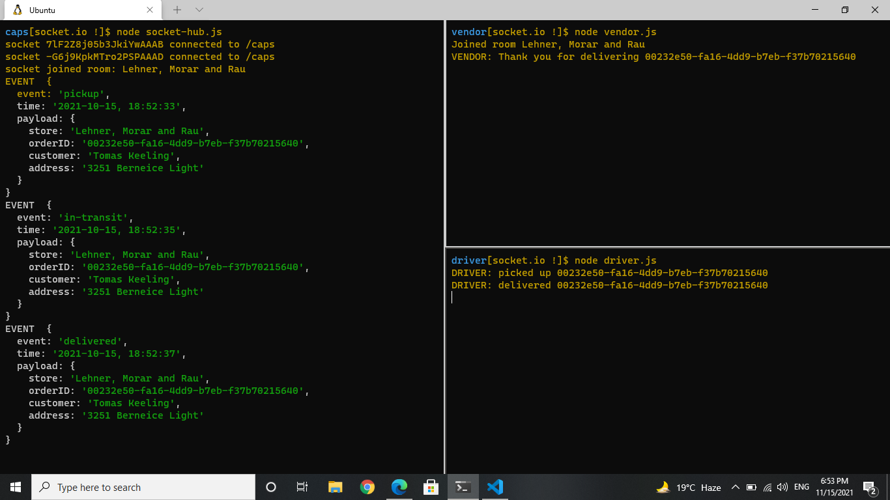
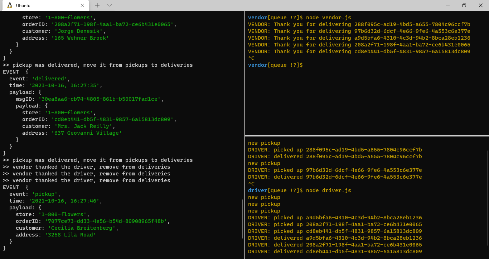
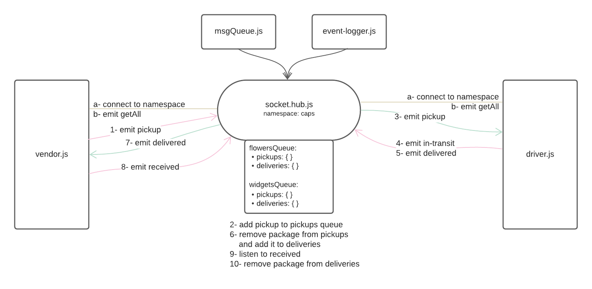
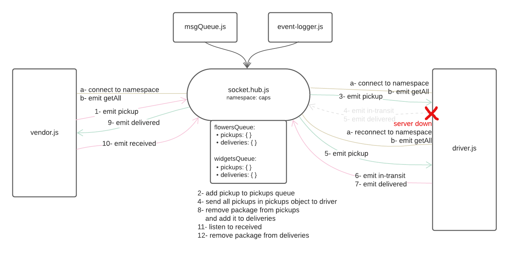

# CAPS - The Code Academy Parcel Service

## Description

This system emulates a real world supply chain, in which CAPS is a delivery service where vendors will ship products using this delivery service and when drivers deliver them, be notified that their customers received what they purchased.

## Phase 1

Created an Event-Driven application that distributes the responsibility of stimulating different parts of the system to separate modules, using only events to trigger logging the processes based on activity.

* `event-pool.js` is the global event pool module in which we created a single EventEmitter from the Node JS module and exported it to the app modules.
* `event-manager.js` is the module that manages all the global package events. It listens to all the events in the event pool, logs a timestamp and the payload of every event, and emits other events.
* `vendor.js` is the module the manages the vendor events. It simulates a *pickup* event for the a store; it generates a payload for the event, them emits it. Additionally, it listens for delivered event and responds by logging a message to the console.
* `driver.js` is the module that manages driver events. It listens for a pickup event and responds with a log a message to the console, emitting an *in-transit* event, logging a confirmation message to the consol, then emitting a *delivered* event.

### Results

### Testing

### UML

## Phase 2

Implementing the system using socket.io so that we can do networked events. Socket.io manages the connection and broadcasts the events to clients.

The core functionality that has been built during phase 1 remains the same. The difference in this phase is that a networking layer has been created. As such, the user stories that speak to application functionality remain unchanged.

**Files**:

* `socket-hub.js` is configured using the socket.io package as an event Server that can be started at a designated port using node. It accepts connections on the root and on a namespace called `/caps`. Also, it allows clients to join rooms.
* `vendor -> vendor.js` connects to the `/caps` namespace in the CAPS application server using socket.io-client. It joins a room upon connection with the store name. It emits the `pickup` event and listens for the `delivered` event.
* `driver -> driver.js` connects to the `/caps` namespace in the CAPS application server using socket.io-client. It listens for the `pickup` event and emits the `in-transit` and `delivered` events.
* `event-logger.js` it console log's each event

**Events**:

* `pickup` - simulates a new customer order
* `in-transit` - stimulates a driver has picked up the order
* `delivered` - stimulates an order has been delivered to the customer 
* `joinRoom` - to join a room in the `/caps` namespace
* `joinedRoom` - after being successfully added to a room

### Results

### Testing

### UML

## Phase 3

In this phase, the code was refactored and a message queue was added to guarantee that payloads from events are delivered to any Client Module that is listening for specific events.

The server `socket-hub.js` is going to have the same overall functionality, but since we have 2 stores, 2 new message queues were added for each. The queues are instances of the MsgQueue class defined in `msgQueue.js`. A msgQueue has 2 objects: pickups to log all the pickup requests coming from the vendor, and deliveries to log all the items delivered by driver.

Drivers are subscribed to pickup queue so they get notified when there is a new package to deliver. When a driver delivers a package, it will be removed from the pickup queue and added to the delivered queue.
Vendors are subscribed to the delivers queue, all packages that has been delivered are logged there. Vendor will be notified when a new package is added to the queue, then, a `received` event will be emitted to tell the system that the package can be removed from delivered queue now.

`getAll` event is an event that will be fired each time a client has connected to the server to check if they have missed any logs while absent.

### Results

In this figure, 2 pickup events were processed, then the driver unconnected. When the driver reconnected, the `getAll` event was fired to receive all the undelivered pickup queue logs. The driver got the requests and processed them normally.

### UMLs

#### normal running

#### driver app down

